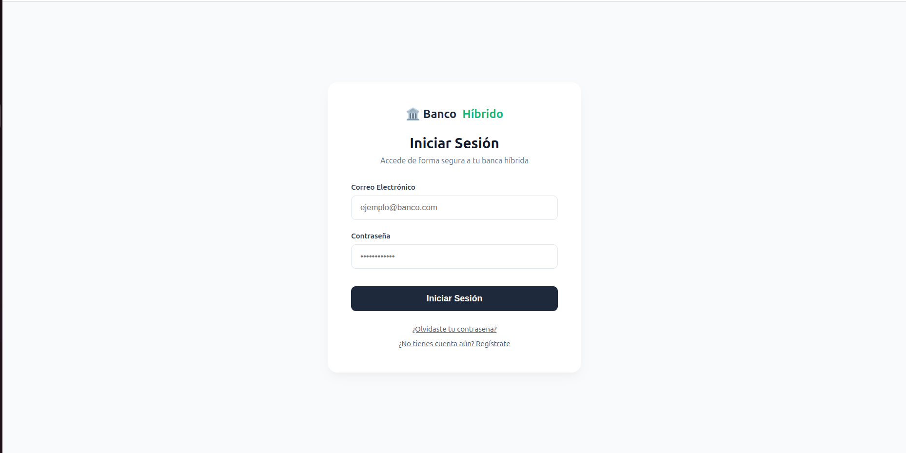
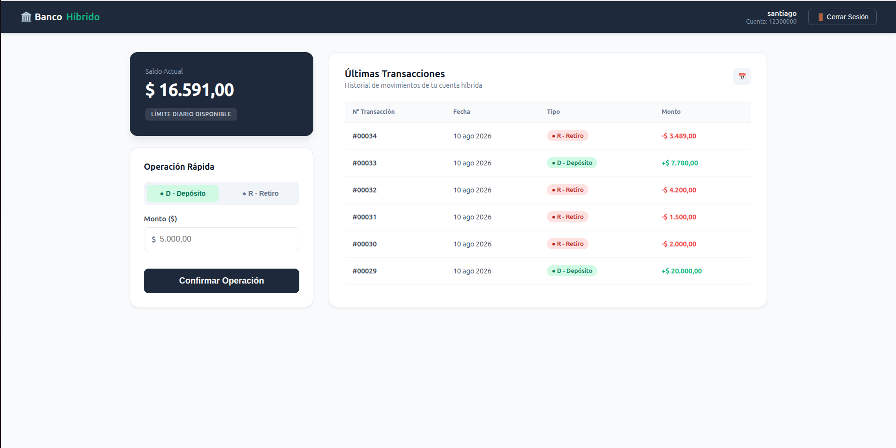
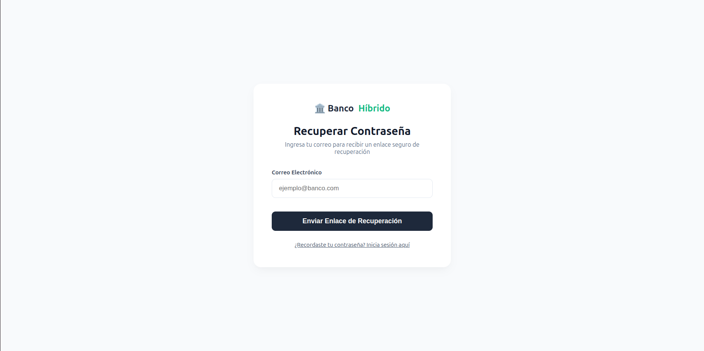
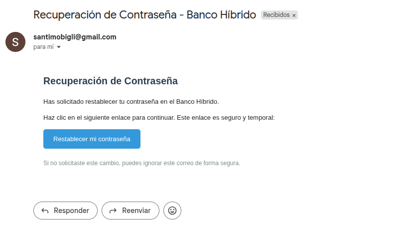
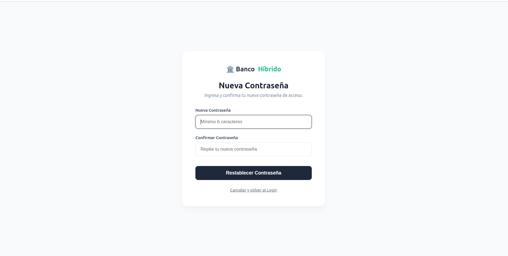

# 🏦 Sistema Bancario Híbrido Full-Stack (React + FastAPI + IBM Mainframe)

Este repositorio contiene la arquitectura completa de un Sistema Bancario Híbrido. El proyecto demuestra la integración bidireccional entre un entorno **IBM Mainframe (z/OS) / COBOL** para el procesamiento por lotes (*Batch Processing*) nocturno, y un ecosistema web moderno compuesto por un backend en **Python (FastAPI)** y un frontend interactivo en **React**.

## 🚀 Visión General del Proyecto

En el mundo bancario real, las operaciones en tiempo real de los usuarios deben conciliarse con motores transaccionales heredados (*Legacy Core*). Este sistema replica esa realidad industrial mediante una arquitectura de dos velocidades:
1.  **Tiempo Real (Web):** Los usuarios interactúan con una interfaz moderna para ver sus saldos y registrar nuevas operaciones.
2.  **Diferido (Batch Nocturno):** Un motor ETL orquestado extrae las operaciones diarias, las procesa masivamente en el Mainframe con precisión matemática (COBOL) y sincroniza los resultados finales en la base de datos relacional.

---

## 🛠️ Prerrequisitos y Configuración Local

Para ejecutar este proyecto localmente, necesitas tener instalado:
* Node.js (v18+)
* Python (3.10+)
* MySQL Server
* Zowe CLI (Opcional, para simulación de conexión al Mainframe)

### Backend (FastAPI)
1. Clonar el repositorio: `git clone https://github.com/tu-usuario/banco-hibrido.git`
2. Crear un entorno virtual: `python -m venv venv`
3. Activar el entorno e instalar dependencias: `pip install -r requirements.txt`
4. Configurar variables de entorno:
   * Copia el archivo de ejemplo: `cp .env.example .env`
   * Abre el nuevo archivo `.env` y completa las variables con tus credenciales locales (Base de datos, JWT y SMTP para correos).
5. Iniciar el servidor: `uvicorn main:app --reload`

### Frontend (React)
1. Navegar a la carpeta frontend: `cd frontend`
2. Instalar dependencias: `npm install`
3. Configurar variables de entorno:
   * Copia el archivo de ejemplo: `cp .env.example .env` (Asegúrate de configurar la URL de tu API).
4. Iniciar el servidor de desarrollo: `npm run dev`

## ⚙️ Arquitectura y Stack Tecnológico

### 1. Frontend (Capa de Presentación)
*   **Tecnología:** React.js
*   **Funcionalidades:** 
    *   Autenticación de usuarios e ingreso seguro a cuentas.
    *   Dashboard interactivo para consultar saldos actualizados y datos del cliente.
    *   Interfaz para realizar operaciones transaccionales (retiros, depósitos, etc.).
    *   Visualización del historial de transacciones y estados de cuenta.

### 2. Backend (API REST & Orquestación)
*   **Tecnología:** Python 3, FastAPI, SQLAlchemy, Pydantic.
*   **Características:**
    *   **Enrutamiento Modular:** Uso de `APIRouter` para separar la lógica de negocio y endpoints.
    *   **Validación Estricta:** Esquemas de datos (Schemas) para garantizar la integridad de las peticiones (Pydantic).
    *   **Automatización (Cron Jobs):** Uso de `APScheduler` para disparar el flujo ETL automáticamente a las 12:01 AM.
    *   **Logging y Auditoría:** Sistema centralizado de logs para rastrear la actividad de la API, errores y el estado del procesamiento nocturno.
*   **Base de Datos:** MySQL (Gestión de usuarios, histórico transaccional y registro de excepciones).
*   **Seguridad Integral:** Autenticación basada en tokens JWT, hasheo de contraseñas con `bcrypt` y protección de rutas.
*   **Gestión de Credenciales:** Flujo seguro de recuperación de contraseñas mediante envío de correos electrónicos transaccionales usando `FastMail` y `BackgroundTasks` para no bloquear el Hilo Principal.

### 3. Core Bancario (Capa Mainframe / Legacy)
*   **Tecnología:** COBOL, JCL (Job Control Language), Zowe CLI, IBM z/OS.
*   **Características:**
    *   **ETL Híbrido:** Comunicación directa entre el Backend y el Mainframe vía línea de comandos.
    *   **Split-Processing:** Enrutamiento dinámico en COBOL que separa transacciones exitosas (saldos) de excepciones (auditoría).
    *   **Precisión Financiera:** Uso de variables empaquetadas (`COMP-3`) y manejo estricto de cortes de control.

---

## 📂 Estructura del Proyecto

El repositorio está dividido en módulos independientes para garantizar la escalabilidad:

*   **/frontend/**: Aplicación cliente interactiva construida con React y Vite.
    * `src/pages/`: Contiene las vistas principales de la aplicación (Dashboard de la cuenta, flujos de autenticación y recuperación de contraseñas).
    * `src/services/api.js`: Configuración centralizada de Axios para gestionar todas las peticiones HTTP al backend de FastAPI.
    * `src/assets/`: Recursos estáticos e imágenes.
*   **/backend/**: Servidor FastAPI, conexión a Base de Datos (MySQL), configuración de esquemas (Pydantic), y lógica CRUD.
    *   `/COMUNICACION_MAINFRAME/`: Motor ETL automatizado (Scripts de sincronización bidireccional Python <-> Zowe).
*   **/core_cobol/**: Lógica transaccional nativa del Mainframe.
    *   `/src/BANCOCOR.cbl`: Código fuente principal (Lógica de negocios).
    *   `/jcl/RUNBANCO.jcl`: JCL para compilación y ejecución.
    *   `/data/`: Archivos secuenciales (entrada/salida) procesados por el Mainframe.

---

## ⚠️ Nota sobre el Entorno Mainframe

El código contenido en la carpeta `core_cobol` es **nativo de Mainframe**. No puede ejecutarse directamente en compiladores de PC estándar sin modificaciones, ya que depende fuertemente de la infraestructura de z/OS. 

Para revisores o reclutadores, se han incluido ejemplos de los archivos de entrada y salida generados por el sistema dentro de la carpeta `/data`, permitiendo validar el funcionamiento lógico del programa sin necesidad de credenciales para un entorno IBM Z. Toda la orquestación puede auditarse directamente desde los logs del backend.

---

### 4. 📸 Visuales

### Registro de Cuenta

### Login

### Dashboard Principal

### Flujo de Recuperación de Contraseña

  

  

## 👨‍💻 Autor
**[Santiago Mobiglia]**
*Desarrollo de Software y Arquitectura Backend*